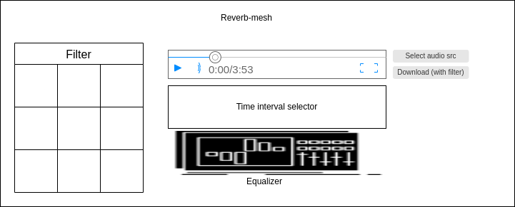

# Reverb-mesh
Dynamically apply filters on an audio stream.

***
- [Reverb-mesh](#Reverb-mesh)
  - [Description](#description)
  - [Design](#design)
***

## Description

Eine Website, die eine Auswahl von Filtern bietet, die man auf eine Audiodatei oder einen Input-Audiostream anwenden kann und dementsprechend eine angepasste Audiodatei/stream ausgibt.
Das ganze soll dynamisch funktionieren, dass heist, dass man während der Stream oder die Audiodatei läuft Filter hinzufügen kann und sich direkt auf die aktuelle Ausgabe auswirken sollen. Man könnte auch die Funktion implementieren mehrere Filter übereinander zu legen.
Bei einer hochgeladenen Audiodatei könnte man eventuell auch eine Art Schnittfunktion hinzufügen, d.h. dass man Filter auch nur auf einen Teil der Audiodatei anwenden kann (z.B. nur während des Refrains).
Das Projekt soll sich vor allem auf die Anwendung der Filter fokussieren und nicht auf deren Erstellung.

## Design

**Design sketch**

